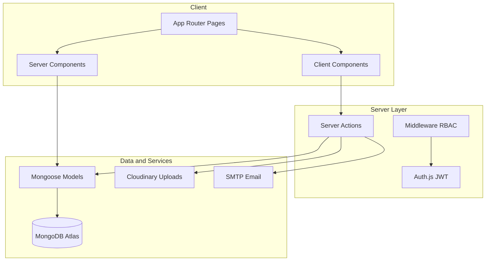
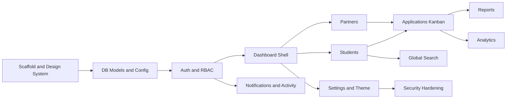

# Lakshya International Edwise — Premium SaaS CRM (Full Build)

## Current state

- Workspace [`/Users/kavinkumar/Kavin/Godevs/NandhiniConsultancy`](/Users/kavinkumar/Kavin/Godevs/NandhiniConsultancy) is **empty** (greenfield).
- Delivery: **full build in one pass** (all modules).
- Database: **MongoDB Atlas** via `.env` connection string.

---

## Architecture overview



**White-label strategy (future clients):** A single deployment with tenant-agnostic code. Client branding lives in the `settings` collection and env-backed secrets — not hardcoded in components.

| Configurable | Source |
|---|---|
| Logo, company name, email | `settings` collection |
| Theme (colors, radius, fonts) | `settings.theme` + CSS variables |
| Enabled modules | `settings.modules` feature flags |
| SMTP, Cloudinary, MongoDB | `.env` (encrypted at rest in settings UI for non-secrets only) |

Core UI reads from `getAppConfig()` in [`lib/config/app-config.ts`](lib/config/app-config.ts) — change branding without touching feature code.

---

## Phase 0 — Project scaffold and design system

### 0.1 Initialize Next.js 15 project

```bash
npx create-next-app@latest . --typescript --tailwind --eslint --app --src-dir=false --import-alias "@/*"
```

Add dependencies:

- **UI:** `shadcn/ui` (init), `framer-motion`, `lucide-react`, `sonner`, `next-themes`
- **Forms:** `react-hook-form`, `@hookform/resolvers`, `zod`
- **Data:** `mongoose`, `@tanstack/react-query`, `@tanstack/react-table`
- **Charts:** `recharts`
- **Auth:** `next-auth@beta` (Auth.js v5), `bcryptjs`
- **Uploads:** `cloudinary`, `next-cloudinary`
- **Export:** `@react-pdf/renderer` or `jspdf` + `xlsx` + native CSV
- **DnD (Kanban):** `@dnd-kit/core`, `@dnd-kit/sortable`
- **Security:** `zod` sanitization helpers, `rate-limiter-flexible` or Upstash rate limit
- **Utils:** `date-fns`, `clsx`, `tailwind-merge`

### 0.2 Folder structure (as specified)

```
app/
  (auth)/login, register, forgot-password, reset-password, verify-email
  (dashboard)/dashboard/overview, students, partners, applications,
                reports, analytics, settings, profile
  api/auth/[...nextauth]/route.ts   # Auth.js handler only
components/
  ui/           # shadcn primitives
  dashboard/    # shell, sidebar, topbar, stat-cards
  forms/        # RHF field wrappers, image/doc upload
  charts/       # recharts wrappers
  cards/        # profile, metric, glass cards
  tables/       # TanStack table shell
models/         # Mongoose schemas
lib/
  auth/         # Auth.js config, permissions, session helpers
  config/       # app-config, env validation (zod)
  db/           # mongoose connect (cached singleton)
  actions/      # server actions grouped by domain
  services/     # activity log, email, export, search
  utils/
hooks/
types/
middleware.ts
```

Every route segment gets: `page.tsx`, `loading.tsx`, `error.tsx`, and shared empty-state components.

### 0.3 Design tokens and premium UI shell

Inspired by Stripe / Linear / Vercel / Notion:

- **Layout:** Collapsible sidebar + sticky top bar + content area with generous padding (`p-6 lg:p-8`)
- **Surfaces:** `rounded-xl`, soft shadows, glass cards (`backdrop-blur`, subtle border gradient via pseudo-element)
- **Motion:** Framer Motion for page transitions, card hover lift, staggered list entrance
- **Typography:** Inter or Geist via `next/font`, clear hierarchy (display / body / caption)
- **Dark/Light/System:** `next-themes` + CSS variables from settings
- **No dummy UI:** All dashboard metrics wired to real MongoDB aggregations (zero hardcoded numbers)

Reusable primitives to build first (used everywhere):

- `MetricCard`, `GlassCard`, `PageHeader`, `DataTable`, `FilterBar`, `SearchCommand` (cmdk), `StatusBadge`, `Timeline`, `FileUpload`, `ConfirmDialog`, `DrawerForm`, `Skeleton*` variants

---

## Phase 1 — Database, env, and core models

### 1.1 Env validation — [`lib/config/env.ts`](lib/config/env.ts)

Zod-validated env:

```
MONGODB_URI, NEXTAUTH_SECRET, NEXTAUTH_URL,
CLOUDINARY_CLOUD_NAME, CLOUDINARY_API_KEY, CLOUDINARY_API_SECRET,
SMTP_HOST, SMTP_PORT, SMTP_USER, SMTP_PASS, SMTP_FROM,
APP_ENCRYPTION_KEY (for sensitive settings at rest)
```

### 1.2 Mongoose connection — [`lib/db/mongoose.ts`](lib/db/mongoose.ts)

Cached singleton pattern for Next.js hot reload.

### 1.3 Collections and schemas

**[`models/User.ts`](models/User.ts)**
- email, passwordHash, name, roleId, avatar, isVerified, rememberMe, lastLogin, status, createdAt

**[`models/Role.ts`](models/Role.ts)** — seed on first run
- name: `super_admin | admin | manager | staff | viewer`
- permissions: string[] (e.g. `students:read`, `students:write`, `partners:delete`, `reports:export`)

**[`models/Student.ts`](models/Student.ts)**
- studentId (auto: `STU-YYYYMMDD-XXXX`), photo, firstName, lastName, gender, dob, phone, whatsapp, email
- address { city, state, pincode, line }
- aadhaar, pan (encrypted at rest)
- education { college, course, year }
- loan { requested, sanctioned, disbursed, interest, bankName, applicationNumber }
- partnerId (ref), status (enum flow), remarks, documents[], timeline[], notes[], metadata { createdBy, ip }

**Status enum:** `new → contacted → documents_pending → submitted → under_verification → approved → sanctioned → disbursed → rejected → closed`

**[`models/Partner.ts`](models/Partner.ts)**
- photo, companyLogo, companyName, owner, phone, email, address, gst, commissionPercent
- bankDetails { accountName, accountNumber, ifsc, bankName }
- status, agreementUrl, documents[], studentsCount (denormalized), totalLoanValue, performance metrics

**[`models/Application.ts`](models/Application.ts)**
- studentId, partnerId, loanAmount, status, pipelineStage, assignedTo, priority, dueDate

**[`models/Activity.ts`](models/Activity.ts)** + **[`models/AuditLog.ts`](models/AuditLog.ts)**
- Activity: business events (student added, status changed)
- AuditLog: who, when, ip, userAgent, action, resourceType, resourceId, diff

**[`models/Notification.ts`](models/Notification.ts)**
- userId, type, title, body, read, link, scheduledAt

**[`models/Settings.ts`](models/Settings.ts)**
- company { name, logo, email, phone, address }
- theme { primary, accent, radius, fontFamily, mode }
- modules { students, partners, applications, reports, analytics, ... }
- smtp (non-secret refs), backup config

**[`models/Document.ts`](models/Document.ts)** (optional embedded in Student/Partner, or separate collection for cross-entity docs)
- entityType, entityId, cloudinaryPublicId, url, mimeType, name, uploadedBy

### 1.4 Indexes (performance + search)

- Text index on Student: name, phone, email, studentId, applicationNumber
- Text index on Partner: companyName, owner, phone, email, gst
- Compound indexes: `{ status, partnerId, createdAt }`, `{ partnerId, status }`

---

## Phase 2 — Authentication and RBAC

### 2.1 Auth.js v5 — [`lib/auth/auth.config.ts`](lib/auth/auth.config.ts)

- **Provider:** Credentials (email + password, bcrypt verify)
- **Session:** JWT strategy with role + permissions embedded
- **Callbacks:** `jwt` (attach role/permissions), `session` (expose to client), `authorized` (route guard)
- **Pages:** custom login at `/login`

Features:
- Remember login (extended JWT maxAge)
- Forgot / reset password (token collection + email via SMTP)
- Email verification (token + `/verify-email` page)
- Session expiry (configurable in settings)
- Secure cookies (`httpOnly`, `sameSite`, `secure` in prod)

### 2.2 RBAC — [`lib/auth/permissions.ts`](lib/auth/permissions.ts)

```typescript
const PERMISSIONS = {
  super_admin: ['*'],
  admin: ['students:*', 'partners:*', ...],
  manager: ['students:read', 'students:write', ...],
  staff: [...],
  viewer: ['*:read'],
} as const;
```

Helper: `hasPermission(session, 'students:write')` used in Server Actions and UI.

### 2.3 Middleware — [`middleware.ts`](middleware.ts)

- Protect `/dashboard/*` and `/api/*` (except auth routes)
- Role-based route redirects (viewer cannot access settings/users)
- Rate limit auth endpoints

### 2.4 Seed script — [`scripts/seed.ts`](scripts/seed.ts)

- Default roles + permissions
- Super Admin user (from env `SEED_ADMIN_EMAIL` / `SEED_ADMIN_PASSWORD`)
- Default settings (Lakshya International Edwise branding)

---

## Phase 3 — Dashboard shell and overview

### 3.1 Dashboard layout — [`app/(dashboard)/layout.tsx`](app/(dashboard)/layout.tsx)

- Sidebar navigation (module-aware: hide disabled modules from settings)
- Top bar: global search (cmdk), theme toggle, notifications bell, user menu
- Breadcrumbs, page transitions (Framer Motion)

### 3.2 Overview page — [`app/(dashboard)/dashboard/overview/page.tsx`](app/(dashboard)/dashboard/overview/page.tsx)

**Server Component** fetching real aggregations via [`lib/services/dashboard.service.ts`](lib/services/dashboard.service.ts):

| Metric | Query |
|---|---|
| Total Students | `Student.countDocuments()` |
| New Students Today | `createdAt >= startOfDay` |
| Partners | `Partner.countDocuments({ status: 'active' })` |
| Pending Applications | status in pipeline pre-sanction |
| Sanctioned / Disbursed / Rejected | group by status |
| Loan Amount | sum of sanctioned/disbursed |
| Today's Collection | sum disbursed today |

**UI blocks:**
1. Greeting header ("Good Morning, {name}") + date
2. Animated metric cards (gradient border, glass, hover, Lucide icons)
3. Charts (Recharts wrappers in [`components/charts/`](components/charts/)):
   - Loan Status — Pie
   - Monthly Students — Area
   - Loan Amount — Bar
   - Top Partners — Horizontal Bar
4. Recent Activity timeline (from `Activity`)
5. Latest Students / Partners tables (compact)
6. Upcoming Follow-ups (from notes/reminders with due dates)

Each chart component accepts typed data props — no inline dummy arrays.

---

## Phase 4 — Student module (full CRM)

### Routes

| Route | Purpose |
|---|---|
| `/dashboard/students` | List + filters + bulk actions |
| `/dashboard/students/new` | Create form |
| `/dashboard/students/[id]` | Detail page |
| `/dashboard/students/[id]/edit` | Edit form |

### List page

- TanStack Table: pagination, sorting, column hide/resize/pin, CSV export
- Filters: status, partner, date range, amount, college, course, state, bank
- Bulk actions: delete, export, assign partner, change status, send email, print
- Global search integration

### Create/Edit form — [`components/forms/student-form.tsx`](components/forms/student-form.tsx)

- React Hook Form + Zod schema mirroring Mongoose model
- Photo upload (Cloudinary)
- Document multi-upload (images, PDF, DOC, Excel) with preview/delete/replace
- Autosave draft to `localStorage` + optional server draft field
- Status select with colored badges
- Partner select (searchable combobox)

### Detail page tabs

1. **Profile** — glass profile card
2. **Timeline** — status history + activity
3. **Documents** — grid with preview
4. **Loan History** — amounts over time
5. **Activity** — audit entries
6. **Notes** — add/view notes with author + timestamp
7. **Partner Info** — linked partner summary

### Server Actions — [`lib/actions/student.actions.ts`](lib/actions/student.actions.ts)

- `createStudent`, `updateStudent`, `deleteStudent`, `bulkUpdateStudents`
- Auto-generate `studentId`
- Write Activity + AuditLog on every mutation
- Permission checks + Zod input validation + sanitization
- Optimistic-update-friendly return shapes for React Query

---

## Phase 5 — Partner module

### Routes

- `/dashboard/partners` — list
- `/dashboard/partners/new`, `/dashboard/partners/[id]`, `/dashboard/partners/[id]/edit`

### Partner profile page

- Company header (logo + name + status badge)
- Stats: students count, total loan value, commission earned
- Analytics charts: monthly leads, sanction rate, disbursement, commission
- Linked students table
- Documents + agreement upload

### Server Actions — [`lib/actions/partner.actions.ts`](lib/actions/partner.actions.ts)

- CRUD + performance aggregation updates (triggered on student status changes)

---

## Phase 6 — Applications module (pipeline)

### Routes

- `/dashboard/applications` — Kanban (default) + Table toggle

### Kanban view — [`components/dashboard/application-kanban.tsx`](components/dashboard/application-kanban.tsx)

- Columns map to status stages
- `@dnd-kit` drag-and-drop between columns
- On drop: Server Action updates status, logs activity, sends notification
- Card shows student name, loan amount, partner, priority, due date

### Table view

- Same data, TanStack Table with inline status edit

---

## Phase 7 — Reports module

### Route: `/dashboard/reports`

- Period tabs: Daily / Weekly / Monthly / Yearly
- Report types: Partner-wise, Student-wise, Loan-wise
- Server-side aggregation pipelines in [`lib/services/report.service.ts`](lib/services/report.service.ts)
- Export: PDF (react-pdf), Excel (xlsx), CSV, Print (print-friendly CSS)

---

## Phase 8 — Analytics module

### Route: `/dashboard/analytics`

Charts (all Recharts, real data):

- Heat map (applications by day/hour or state/month grid)
- Trend lines (students, loans over time)
- Conversion funnel (status stage counts)
- Partner performance comparison
- Monthly revenue (disbursement totals)
- Loan distribution (amount ranges)
- Student demographics (gender, state, course)

Shared chart theme matching app design tokens (no default Recharts gray).

---

## Phase 9 — Global search

### [`components/dashboard/global-search.tsx`](components/dashboard/global-search.tsx)

- Cmd+K command palette (shadcn Command)
- Debounced server search via [`lib/services/search.service.ts`](lib/services/search.service.ts)
- Searches: students, partners, applications by name, phone, email, loan number, studentId
- MongoDB `$text` + regex fallback on phone
- Instant results grouped by entity type with keyboard navigation

---

## Phase 10 — Notifications and activity

- **Toast:** Sonner for inline feedback on all mutations
- **Email:** [`lib/services/email.service.ts`](lib/services/email.service.ts) — nodemailer + SMTP from env/settings
- **System notifications:** bell dropdown + `/dashboard/notifications` (optional sub-route)
- **Reminders:** scheduled notifications for follow-ups
- **Activity log service:** centralized [`lib/services/activity.service.ts`](lib/services/activity.service.ts) called from every Server Action

---

## Phase 11 — Settings module

### Route: `/dashboard/settings` (tabbed)

| Tab | Features |
|---|---|
| Company | Logo upload (Cloudinary), name, contact |
| Email/SMTP | Test send button |
| Theme | Color pickers, radius, font; live preview |
| Modules | Toggle feature flags |
| Users | CRUD users, assign roles |
| Roles | View/edit permission matrix (super_admin only) |
| Security | Password policy, session expiry |
| Integrations | Cloudinary status, MongoDB health check |
| Backup | Export JSON snapshot of collections (admin) |

Theme changes apply via CSS variables without rebuild.

---

## Phase 12 — Profile and user management

- `/dashboard/profile` — avatar, name, password change, preferences (theme override)
- User invite flow (admin creates user → email with temp password or reset link)

---

## Phase 13 — Security hardening

- **Headers:** `next.config.ts` — CSP, X-Frame-Options, HSTS, Referrer-Policy
- **CSRF:** Auth.js built-in + Server Action origin check
- **Rate limiting:** login, forgot-password, search endpoints
- **Input validation:** Zod on every Server Action boundary
- **Sanitization:** strip HTML from text fields
- **Encryption:** Aadhaar/PAN encrypted with `APP_ENCRYPTION_KEY`
- **RBAC:** enforced server-side (never trust client role checks alone)
- **Audit logs:** immutable append-only pattern

---

## Phase 14 — Performance and DX

- Server Components for all read-heavy pages
- React Query for client-side cache + optimistic updates on mutations
- `dynamic import()` for charts, Kanban, export libs
- `next/image` for all Cloudinary images with transforms
- Pagination on all lists (never fetch all records)
- MongoDB aggregation pipelines with `$match` early + indexes
- Shared TypeScript types in [`types/`](types/) — **strict, no `any`**

---

## Key implementation patterns

### Server Action template

Every action follows: `auth check → permission check → zod parse → service call → activity log → revalidatePath → return typed result`

### Status badges

Central map in [`lib/constants/statuses.ts`](lib/constants/statuses.ts):

```typescript
export const STUDENT_STATUS_CONFIG = {
  new: { label: 'New', color: 'bg-blue-500/10 text-blue-600', ... },
  sanctioned: { label: 'Sanctioned', color: 'bg-emerald-500/10 ...', ... },
  // ...
} as const;
```

### File uploads

[`lib/services/upload.service.ts`](lib/services/upload.service.ts) — Cloudinary signed upload from Server Action; store publicId + secureUrl in document subdocs.

---

## Environment and deployment

**`.env.example`** committed; **`.env.local`** gitignored.

Deploy target: **Vercel** (recommended for Next.js 15). MongoDB Atlas IP allowlist includes Vercel IPs or `0.0.0.0/0` with strong credentials.

Post-deploy: run seed script once to create Super Admin + default settings.

---

## Build sequence (implementation order)

Even in a full build, implement in this dependency order to avoid rework:



---

## Acceptance criteria

- Zero TypeScript errors, zero ESLint errors
- No placeholder/dummy metric data anywhere
- Every page has loading skeleton, error boundary, empty state
- All CRUD flows persist to MongoDB Atlas and appear in activity/audit logs
- Role permissions enforced on every mutation
- Theme/branding changeable from Settings without code changes
- Responsive: desktop, tablet, mobile
- Premium UI: glass cards, gradient borders, micro-animations, no Bootstrap/AdminLTE aesthetic
