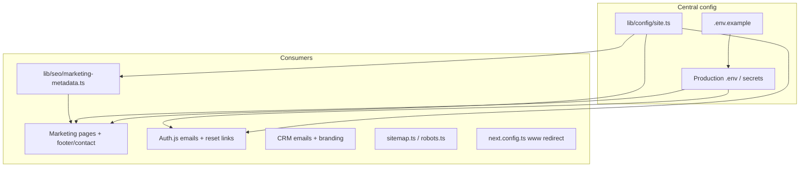

# Domain + Email + SEO Migration Plan

## Current state

The app is already **env-driven** for domain and contact email:

- Site URL: [`lib/config/marketing.ts`](lib/config/marketing.ts) → `NEXT_PUBLIC_SITE_URL` (falls back to `getPublicAuthUrl()`)
- Auth/portal/email links: [`lib/config/env.ts`](lib/config/env.ts) → `AUTH_URL` / `NEXTAUTH_URL`
- Contact email: `NEXT_PUBLIC_CONTACT_EMAIL`, `APP_COMPANY_EMAIL`, `WEBSITE_ENQUIRY_NOTIFY_EMAIL`, `SMTP_FROM`

Hardcoded `lie.teamgodevs.in` exists only in **tests** ([`tests/auth-url.test.ts`](tests/auth-url.test.ts), [`tests/email-templates.test.ts`](tests/email-templates.test.ts)). Production values live in deployment `.env.local` / platform secrets — those must be updated at deploy time.

**SEO today:** canonical URLs on marketing pages, [`app/sitemap.ts`](app/sitemap.ts), [`app/robots.ts`](app/robots.ts), basic `EducationalOrganization` + homepage `FAQPage` JSON-LD. Missing: `metadataBase`, default Open Graph/Twitter image, richer structured data, sitemap priorities, `www` canonicalization, Search Console verification hook.

**Important expectation:** Code and technical SEO improve discoverability, but **no implementation can guarantee #1 Google ranking**. Ranking also depends on Google Search Console setup, content, reviews, backlinks, and Business Profile — included as a post-deploy checklist.

---

## Architecture after change



---

## 1. Central production constants

Add [`lib/config/site.ts`](lib/config/site.ts):

```ts
export const PRODUCTION_SITE_URL = "https://lakshyainternationaledwise.com";
export const PRODUCTION_SUPPORT_EMAIL = "support@lakshyainternationaledwise.com";
export const PRODUCTION_COMPANY_NAME = "Lakshya International Edwise";
```

Wire as **production fallbacks** (env still wins when set):

| File | Change |
|------|--------|
| [`lib/config/marketing.ts`](lib/config/marketing.ts) | `getSiteUrl()` → fallback to `PRODUCTION_SITE_URL` in production; contact email → `PRODUCTION_SUPPORT_EMAIL` |
| [`lib/config/app-defaults.ts`](lib/config/app-defaults.ts) | Default `email` to `PRODUCTION_SUPPORT_EMAIL` in production |
| [`lib/config/env.ts`](lib/config/env.ts) | `getPublicAuthUrl()` / `getAuthUrl()` → fallback to `PRODUCTION_SITE_URL` in production when `AUTH_URL` unset |

This ensures emails, portal links, and website URLs stay correct even if one env var is missed.

---

## 2. Environment + deployment updates

Update [`.env.example`](.env.example) with production-oriented defaults:

```env
AUTH_URL=https://lakshyainternationaledwise.com
NEXTAUTH_URL=https://lakshyainternationaledwise.com
NEXT_PUBLIC_SITE_URL=https://lakshyainternationaledwise.com
NEXT_PUBLIC_CONTACT_EMAIL=support@lakshyainternationaledwise.com
APP_COMPANY_EMAIL=support@lakshyainternationaledwise.com
WEBSITE_ENQUIRY_NOTIFY_EMAIL=support@lakshyainternationaledwise.com
SMTP_FROM="Lakshya International Edwise <support@lakshyainternationaledwise.com>"
NEXT_PUBLIC_GOOGLE_SITE_VERIFICATION=
```

Also fix [`.gitignore`](.gitignore): remove `.env.example` from ignore list so the template is committed (known issue from project review).

**Manual deploy step (required):** update production secrets on Fly/Render/VPS `.env.local` with the same values. Document in [`deploy/README.md`](deploy/README.md) and [`README.md`](README.md).

**No redirect** from `lie.teamgodevs.in` (per your choice). Old domain should be de-indexed separately in Search Console if it was indexed.

---

## 3. Canonical `www` → apex redirect

In [`next.config.ts`](next.config.ts), add permanent redirect:

- `www.lakshyainternationaledwise.com/*` → `https://lakshyainternationaledwise.com/*` (308)

Ensures one canonical host for SEO and avoids duplicate content.

---

## 4. SEO layer (code changes)

### 4a. Central metadata helper

Create [`lib/seo/marketing-metadata.ts`](lib/seo/marketing-metadata.ts):

- `getMetadataBase()` → `new URL(getSiteUrl())`
- `buildMarketingMetadata({ title, description, path, image?, keywords?, noIndex? })` returning full Next.js `Metadata`:
  - `metadataBase`
  - `alternates.canonical`
  - `openGraph` (title, description, url, type, siteName, locale `en_IN`, default image)
  - `twitter` (`summary_large_image`)
  - `robots: { index: true, follow: true }` for public pages
  - `keywords` for India study-abroad terms
  - `verification.google` from `NEXT_PUBLIC_GOOGLE_SITE_VERIFICATION`

Default OG image: `/logo_model.jpeg` or a dedicated `/og-image.jpg` in `public/` (add 1200×630 asset if missing).

### 4b. Apply across marketing routes

Refactor `generateMetadata()` in all [`app/(marketing)/`](app/(marketing)/) pages to use `buildMarketingMetadata()` instead of ad-hoc objects. Pages affected (~15): home, about, services (+slug), countries (+slug), blog (+slug), contact, gallery, success-stories, education-loans, privacy, terms.

Add `generateMetadata()` to [`app/(marketing)/layout.tsx`](app/(marketing)/layout.tsx) with shared `metadataBase` + default OG fallbacks.

### 4c. Rich structured data

Extend [`components/marketing/seo/json-ld.tsx`](components/marketing/seo/json-ld.tsx):

| Schema | Where |
|--------|-------|
| `EducationalOrganization` + `logo` + `sameAs` (social URLs) | Marketing layout (enhance existing) |
| `WebSite` + `SearchAction` | Homepage |
| `FAQPage` | Homepage (existing) |
| `BreadcrumbList` | Inner pages (services, countries, blog) |
| `Article` | Blog post pages |
| `Service` | Service detail pages |
| `LocalBusiness` | Contact page (when address/phone available from env) |

### 4d. Sitemap + robots polish

Update [`app/sitemap.ts`](app/sitemap.ts):

- Homepage: `priority: 1`, `changeFrequency: 'weekly'`
- Services/countries/blog: `priority: 0.8`, `changeFrequency: 'monthly'`
- Legal pages: `priority: 0.3`

[`app/robots.ts`](app/robots.ts): keep disallow for `/dashboard/`, `/api/`, auth routes (already correct).

### 4e. On-page SEO quick wins

- Homepage `<h1>` and meta description: include primary keywords ("study abroad consultancy India", "education loan", city/brand if known)
- Blog posts: add `Article` JSON-LD with `datePublished`, `author`, `image`
- Remove visible "Google Reviews placeholder" line from [`components/marketing/sections/google-reviews.tsx`](components/marketing/sections/google-reviews.tsx) (hurts trust/SEO)

---

## 5. Email + portal consistency

No template hardcoding changes needed — emails already use `getPublicAuthUrl()` and `getDefaultCompanySettings().email` ([`lib/services/email.service.ts`](lib/services/email.service.ts)).

After env/defaults update, all transactional emails will use:

- Links: `https://lakshyainternationaledwise.com/...`
- From/reply branding: `support@lakshyainternationaledwise.com`

Run `npm run seed` or update Settings in CRM admin if DB-stored company email still shows old value.

---

## 6. Tests + lint

| File | Update |
|------|--------|
| [`tests/auth-url.test.ts`](tests/auth-url.test.ts) | Replace `lie.teamgodevs.in` with `lakshyainternationaledwise.com` |
| [`tests/email-templates.test.ts`](tests/email-templates.test.ts) | Same domain swap |
| New `tests/marketing-seo.test.ts` | Assert `buildMarketingMetadata()` canonical, OG url, production fallback |
| New `tests/site-config.test.ts` | Assert production constants |

Run `npm run lint`, `npm test`, `npm run build` before finish.

---

## 7. Post-deploy SEO checklist (for client — not code)

Document in [`scripts/webNotes/domain-seo-migration-checklist.md`](scripts/webNotes/domain-seo-migration-checklist.md):

1. Point DNS A/CNAME for `lakshyainternationaledwise.com` to hosting
2. Add `www` CNAME and verify apex redirect works
3. Google Search Console: add property, submit `sitemap.xml`, request indexing for homepage
4. Google Business Profile: set website to new domain, NAP consistency
5. Configure `support@` mailbox + SPF/DKIM/DMARC for deliverability
6. Update social profiles / backlinks to new URL
7. If old domain was indexed: remove property or mark as moved (since no 301, use "Change of address" only if both domains stay live temporarily)

---

## Files to touch (summary)

**New:** `lib/config/site.ts`, `lib/seo/marketing-metadata.ts`, `tests/marketing-seo.test.ts`, `tests/site-config.test.ts`, `scripts/webNotes/domain-seo-migration-checklist.md`

**Update:** `.env.example`, `.gitignore`, `lib/config/marketing.ts`, `lib/config/app-defaults.ts`, `lib/config/env.ts`, `next.config.ts`, `components/marketing/seo/json-ld.tsx`, `app/(marketing)/layout.tsx`, all marketing `page.tsx` metadata, `app/sitemap.ts`, `google-reviews.tsx`, tests, `README.md`, `deploy/README.md`

**Out of scope:** DNS/hosting panel changes, mailbox provisioning, guaranteed search ranking
