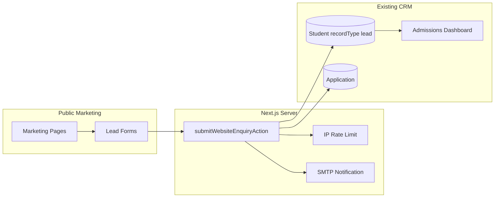

# Lakshya International Edwise — Marketing Website Plan

## Context

| Item | Finding |
|------|---------|
| Workspace `lakshyaweb` | Empty — no code yet |
| Existing app | [`/Users/kavinkumar/Kavin/Godevs/NandhiniConsultancy`](/Users/kavinkumar/Kavin/Godevs/NandhiniConsultancy) (`lakshya-international-edwise`) |
| Architecture choice | **Monolith** — public marketing + CRM in one Next.js deploy |
| Blog | **Static MDX now**, MongoDB CMS in a later phase |
| CRM leads today | `Student` docs with `recordType: "lead"`; created only via authenticated [`createLeadAction`](NandhiniConsultancy/lib/actions/student.actions.ts) |



---

## Phase 1 — Foundation and CRM bridge

### 1.1 Marketing route group

Add `app/(marketing)/` with its own layout so dashboard/auth stay untouched.

| File | Purpose |
|------|---------|
| [`app/(marketing)/layout.tsx`](NandhiniConsultancy/app/(marketing)/layout.tsx) | Marketing shell: Navbar, Footer, sticky CTA, enquiry popup |
| [`app/(marketing)/page.tsx`](NandhiniConsultancy/app/(marketing)/page.tsx) | Home (replaces current redirect-only [`app/page.tsx`](NandhiniConsultancy/app/page.tsx)) |

**Root route change:** Delete redirect logic in `app/page.tsx`; re-export or move home into `(marketing)/page.tsx` so `/` serves the public site. Logged-in staff reach CRM via Navbar “Staff Login” → `/login` (existing [`proxy.ts`](NandhiniConsultancy/proxy.ts) matcher already leaves marketing routes public).

### 1.2 Marketing design system (scoped theme)

CRM dashboard keeps its orange theme. Marketing gets a **scoped token override** via a wrapper class (e.g. `.marketing-site`) in a new [`app/(marketing)/marketing.css`](NandhiniConsultancy/app/(marketing)/marketing.css):

| Token | Value |
|-------|-------|
| Primary | Emerald (`#059669` / `oklch(0.596 0.145 163)`) |
| Secondary | Dark Navy (`#0F172A`) |
| Accent | Sky Blue (`#0EA5E9`) |
| Background | `#FFFFFF` |
| Text | Slate (`#1E293B`) |

Reuse existing SN Pro font from [`lib/fonts.ts`](NandhiniConsultancy/lib/fonts.ts). Add subtle Framer Motion presets in [`lib/motion/marketing.ts`](NandhiniConsultancy/lib/motion/marketing.ts) (fade/slide/scale only — no flashy motion).

### 1.3 Public lead submission (core CRM integration)

Create [`lib/actions/enquiry.actions.ts`](NandhiniConsultancy/lib/actions/enquiry.actions.ts) with `submitWebsiteEnquiryAction`:

- **No auth** — public server action
- **Rate limit** — add `"website-enquiry"` to [`lib/rate-limit.ts`](NandhiniConsultancy/lib/rate-limit.ts) (e.g. 5 submissions / 15 min per IP via existing `getClientIp()`)
- **Validation** — new Zod schema in [`lib/validations/schemas.ts`](NandhiniConsultancy/lib/validations/schemas.ts):

```ts
// websiteEnquirySchema fields
name, phone, email?, targetCountry?, course?, loanRequired?: boolean, message?, enquiryType
```

- **DB write** — reuse existing services:
  - `connectDB()` from [`lib/db/mongoose.ts`](NandhiniConsultancy/lib/db/mongoose.ts)
  - `allocateStudentId()` from [`lib/services/student-id.service.ts`](NandhiniConsultancy/lib/services/student-id.service.ts)
  - Split `name` → `firstName` / `lastName` (fallback lastName `"."` for single names)
  - `recordType: "lead"`, `status: "new"`
  - Map fields: `targetCountry`, `education.course`, `email`, `phone` (via `normalizeIndianPhone`)
  - `loan.requested` set when `loanRequired === true`
  - Initial `timeline` entry + `notes` entry capturing message and enquiry type
  - Create linked `Application` (same pattern as `createLeadAction`) so admissions pipeline works immediately
- **Lead source** — extend `Student.metadata` in [`models/Student.ts`](NandhiniConsultancy/models/Student.ts):

```ts
metadata: {
  leadSource?: string;      // "website"
  enquiryType?: string;     // consultation | quick | contact | loan | country
  formPage?: string;        // /countries/usa etc.
  ip?: string;
}
```

- **Activity log** — `logActivity({ action: "admission.created", ... })` with `createdByName: "Website"`
- **Email** — new `sendWebsiteEnquiryNotification()` in [`lib/services/email.service.ts`](NandhiniConsultancy/lib/services/email.service.ts) to `WEBSITE_ENQUIRY_NOTIFY_EMAIL` or `APP_COMPANY_EMAIL` (graceful no-op if SMTP unset)
- **Revalidate** — `/dashboard/admissions` so CRM shows the lead instantly

### 1.4 Shared form component

[`components/marketing/forms/lead-form.tsx`](NandhiniConsultancy/components/marketing/forms/lead-form.tsx):

- react-hook-form + zodResolver (matches CRM patterns)
- Variants: `consultation`, `quick`, `contact`, `loan`, `country` (field visibility via props)
- Honeypot field for basic bot protection
- Loading / success / error states with Framer Motion
- Used everywhere: hero, CTAs, contact, country pages, sticky bar, popup

---

## Phase 2 — Reusable components

Organize under `components/marketing/`:

| Component | Notes |
|-----------|-------|
| `layout/navbar.tsx` | Sticky, transparent → solid on scroll, mega menu, mobile sheet, search (client-side filter over static nav), “Book Consultation” CTA |
| `layout/footer.tsx` | Links, countries, services, policies, newsletter (phase 1: UI + optional mailto; no backend newsletter yet) |
| `layout/sticky-cta.tsx` | Mobile floating WhatsApp + Book Consultation |
| `layout/enquiry-dialog.tsx` | Delayed popup (once per session via `sessionStorage`) |
| `sections/hero.tsx` | Full-width hero, dual CTAs, animated stat counters |
| `sections/section-heading.tsx` | Consistent typography hierarchy |
| `sections/stats-bar.tsx` | Animated counters (years, students, universities, countries, loans) |
| `sections/faq.tsx` | Accordion — add shadcn `accordion` component |
| `sections/testimonials.tsx` | Carousel — add shadcn `carousel` component |
| `cards/country-card.tsx`, `service-card.tsx`, `testimonial-card.tsx`, `blog-card.tsx`, `university-card.tsx` | Reusable card primitives |
| `sections/cta-banner.tsx` | Reused at bottom of every major page |
| `gallery/gallery-grid.tsx` | CSS grid + lightbox dialog, `next/image` + lazy loading |
| `seo/json-ld.tsx` | Organization, WebSite, FAQPage, BreadcrumbList helpers |

Content constants (no hardcoded copy in components):

- [`lib/constants/marketing/navigation.ts`](NandhiniConsultancy/lib/constants/marketing/navigation.ts)
- [`lib/constants/marketing/services.ts`](NandhiniConsultancy/lib/constants/marketing/services.ts)
- [`lib/constants/marketing/countries.ts`](NandhiniConsultancy/lib/constants/marketing/countries.ts) — 10 countries: USA, Canada, UK, Australia, Germany, Ireland, France, New Zealand, Dubai, Europe
- [`lib/constants/marketing/stats.ts`](NandhiniConsultancy/lib/constants/marketing/stats.ts)
- [`lib/constants/marketing/testimonials.ts`](NandhiniConsultancy/lib/constants/marketing/testimonials.ts)
- [`lib/constants/marketing/faqs.ts`](NandhiniConsultancy/lib/constants/marketing/faqs.ts)
- [`lib/constants/marketing/lenders.ts`](NandhiniConsultancy/lib/constants/marketing/lenders.ts) — align with existing [`lib/constants/lenders.ts`](NandhiniConsultancy/lib/constants/lenders.ts)

Types in [`types/marketing.ts`](NandhiniConsultancy/types/marketing.ts).

---

## Phase 3 — Pages

All under `app/(marketing)/` with `generateMetadata()` per page.

| Route | Sections |
|-------|----------|
| `/` | Hero, Services, Countries, Education Loans, Universities, Stats, Testimonials, Why Choose Us, Consultation CTA, Latest Blogs (3), FAQ, Footer CTA |
| `/about` | Company, Mission, Vision, Journey timeline, Why Choose Us, Team |
| `/services` | Grid of 8 services |
| `/services/[slug]` | Study Abroad, Education Loans, Visa, Scholarships, Documentation, Accommodation, Forex, Travel Insurance |
| `/countries` | Country grid |
| `/countries/[slug]` | Hero, Benefits, Top Universities, Cost of Study, Visa, Career, CTA, LeadForm |
| `/education-loans` | Overview, Partner Banks, Process, Eligibility, Documents, EMI info, FAQ, Apply CTA |
| `/success-stories` | Testimonials, Visa success, Placed students |
| `/gallery` | Premium grid + lightbox |
| `/blog` | Card grid, search (client), category filter, pagination |
| `/blog/[slug]` | MDX article, breadcrumbs, related posts, CTA |
| `/contact` | Office info, Google Maps embed, hours, form, WhatsApp/phone/email/social |

**Legal stubs** (footer links, minimal content): `/privacy-policy`, `/terms-of-service`.

**Country dynamic route:** `[slug]` maps to entries in `countries.ts`; `generateStaticParams()` for SSG.

**Service dynamic route:** same pattern for 8 services.

---

## Phase 4 — Blog (static MDX, phase 1)

| Piece | Implementation |
|-------|----------------|
| Content | `content/blog/*.mdx` with frontmatter: `title`, `description`, `date`, `category`, `coverImage`, `author` |
| Parser | Lightweight utility in [`lib/blog/index.ts`](NandhiniConsultancy/lib/blog/index.ts) using `gray-matter` + `next-mdx-remote/rsc` (add deps) |
| Listing | Server Component reads all posts, sorts by date, paginates (9 per page) |
| Search/filter | Client component filters pre-loaded post metadata |
| SEO | Per-post `generateMetadata`, Article JSON-LD |
| Seed | 6–8 real-topic articles (study abroad, loans, visa tips) — professional copy, not lorem ipsum |

**Phase 2 (later):** MongoDB `Blog` model + dashboard CRUD — out of scope for this delivery; structure content layer so CMS can replace the file reader later.

---

## Phase 5 — SEO and performance

| Item | File / approach |
|------|-----------------|
| Sitemap | [`app/sitemap.ts`](NandhiniConsultancy/app/sitemap.ts) — static + dynamic country/service/blog routes |
| Robots | [`app/robots.ts`](NandhiniConsultancy/app/robots.ts) |
| Canonical URLs | `metadata.alternates.canonical` using `NEXT_PUBLIC_SITE_URL` |
| Open Graph / Twitter | Per-page `openGraph` + `twitter` in `generateMetadata` |
| JSON-LD | Organization (root layout), FAQPage, BreadcrumbList, Article |
| Breadcrumbs | Reuse existing [`components/ui/breadcrumb.tsx`](NandhiniConsultancy/components/ui/breadcrumb.tsx) |
| Images | `next/image`, WebP, explicit `width`/`height`, meaningful `alt` |
| Performance | Server Components by default; dynamic import for carousel, lightbox, popup, counters; no unnecessary client boundaries |
| Lighthouse target | 95+ SEO; optimize LCP hero image with `priority` + Cloudinary or optimized `public/` assets |

---

## Phase 6 — `.env.example` additions

Extend [`NandhiniConsultancy/.env.example`](NandhiniConsultancy/.env.example) with marketing-specific vars (all optional except site URL in production):

```bash
# Marketing site
NEXT_PUBLIC_SITE_URL=https://lakshyainternationaledwise.com
NEXT_PUBLIC_CONTACT_PHONE=+91XXXXXXXXXX
NEXT_PUBLIC_CONTACT_EMAIL=hello@lakshyainternationaledwise.com
NEXT_PUBLIC_WHATSAPP_NUMBER=91XXXXXXXXXX
NEXT_PUBLIC_GOOGLE_MAPS_EMBED_URL=https://www.google.com/maps/embed?pb=...
WEBSITE_ENQUIRY_NOTIFY_EMAIL=hello@lakshyainternationaledwise.com

# Social (optional)
NEXT_PUBLIC_FACEBOOK_URL=
NEXT_PUBLIC_INSTAGRAM_URL=
NEXT_PUBLIC_LINKEDIN_URL=
NEXT_PUBLIC_YOUTUBE_URL=

# Analytics (optional, phase 1 stub-ready)
# NEXT_PUBLIC_GA_MEASUREMENT_ID=
```

Existing CRM vars (`MONGODB_URI`, `AUTH_SECRET`, `SMTP_*`, `CLOUDINARY_*`) remain required unchanged.

---

## Phase 7 — Quality gates

Before calling done:

1. `npm run lint` — zero warnings
2. `npm run build` — zero TS/build errors
3. Manual form submit → verify lead appears in `/dashboard/admissions` with `recordType: lead`, `status: new`, `metadata.leadSource: website`
4. Responsive check: 320, 375, 768, 1024, 1280, 1536px
5. No `console.log`, no `TODO`, no unused imports
6. Keyboard nav + focus rings on all interactive elements
7. No hydration mismatches (counters/popup gated with `useEffect` or server-only rendering where needed)

---

## File structure (new)

```
NandhiniConsultancy/
├── app/(marketing)/
│   ├── layout.tsx
│   ├── marketing.css
│   ├── page.tsx                    # Home
│   ├── about/page.tsx
│   ├── services/page.tsx
│   ├── services/[slug]/page.tsx
│   ├── countries/page.tsx
│   ├── countries/[slug]/page.tsx
│   ├── education-loans/page.tsx
│   ├── success-stories/page.tsx
│   ├── gallery/page.tsx
│   ├── blog/page.tsx
│   ├── blog/[slug]/page.tsx
│   └── contact/page.tsx
├── components/marketing/           # ~25 components
├── content/blog/                   # MDX articles
├── lib/actions/enquiry.actions.ts
├── lib/constants/marketing/
├── lib/blog/
├── lib/motion/marketing.ts
└── types/marketing.ts
```

---

## Important notes

- **Work location:** Implementation happens in **NandhiniConsultancy**, not the empty `lakshyaweb` folder. The monolith choice avoids duplicate backends and reuses the live MongoDB connection, models, and admissions dashboard.
- **Dashboard theme unchanged:** Marketing theme is isolated via scoped CSS; CRM UI is not rebranded.
- **Images:** Use Cloudinary (already configured) for gallery/hero; provide sensible defaults in `public/marketing/` for offline dev.
- **Newsletter:** Footer UI in v1; actual subscription backend deferred (avoids scope creep).
