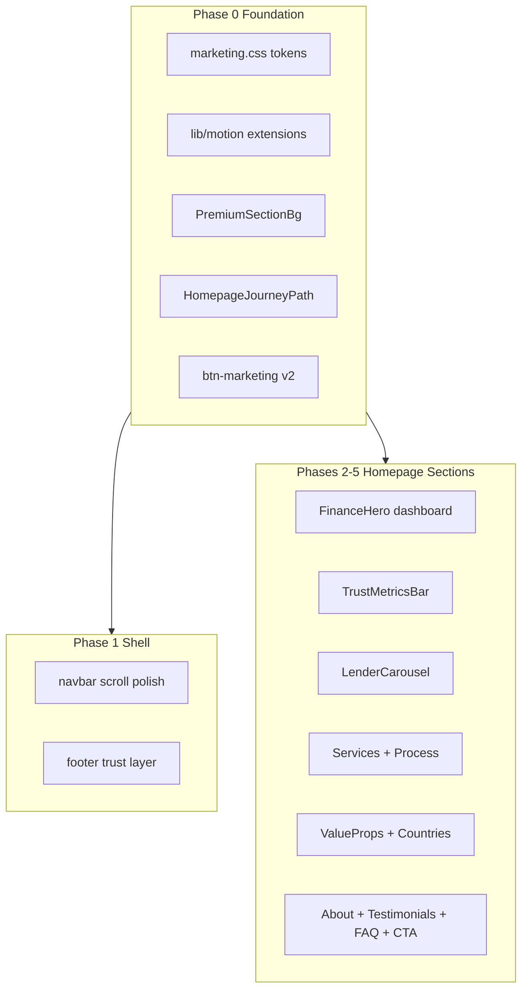

# Premium Lakshya Brand Upgrade Plan

## Constraints (non-negotiable)

- **Enhance only** — no routing changes, no component renames/deletes, no duplicate parallel systems
- Preserve: [`app/(marketing)/page.tsx`](app/(marketing)/page.tsx) section order, eligibility modal flow, mega menu, lender constants, form actions
- Reuse existing primitives: [`SectionShell`](components/marketing/sections/section-shell.tsx), [`Reveal`/`RevealStagger`](components/marketing/motion/reveal.tsx), [`useMarketingMotion`](lib/motion/use-marketing-motion.ts), [`marketing.css`](app/(marketing)/marketing.css)
- All motion: `transform` + `opacity` only; honor `prefers-reduced-motion` (already used in FAQ + hero blobs)
- **Assets:** premium SVG/gradient placeholders for country images, video thumbnails, office gallery until client provides real media

---

## Architecture: what we add (minimal new surface)



| New shared file | Purpose |
|----------------|---------|
| [`components/marketing/backgrounds/premium-section-bg.tsx`](components/marketing/backgrounds/premium-section-bg.tsx) | Subtle radial/map/grid overlays per section (`opacity ≤ 0.05`) |
| [`components/marketing/motion/homepage-journey-path.tsx`](components/marketing/motion/homepage-journey-path.tsx) | Fixed SVG curved path; section anchors via `data-journey-node` |
| [`hooks/use-navbar-scroll.ts`](hooks/use-navbar-scroll.ts) | Extract scroll threshold + compact state from navbar |
| [`hooks/use-mouse-parallax.ts`](hooks/use-mouse-parallax.ts) | Optional 3px hero parallax (disabled on touch + reduced motion) |

No changes to [`app/(marketing)/layout.tsx`](app/(marketing)/layout.tsx) routing; only optional wrapper for journey path on homepage.

---

## Phase 0 — Design foundation (do first)

**Goal:** One visual language before touching sections.

### 0a. Token & typography upgrade — [`marketing.css`](app/(marketing)/marketing.css)

Extend existing sea-blue tokens (do not replace):

- **Typography:** body `18px / 1.75` via `.prose-marketing`; section eyebrows `uppercase tracking-[0.14em] text-xs`; headings slightly tighter `tracking-tight`
- **Shadows:** layered soft shadows on `.card-premium`, `.consultation-card`, `.glass-card` (multi-stop, no harsh drop)
- **Spacing audit:** enforce 8px grid on `.section-padding` (currently 5rem/6rem — verify consistency), card gaps, container max-widths
- **Buttons:** extend `.btn-marketing` with hover gradient shift, arrow slide pseudo-element, glow ring, `250ms cubic-bezier(0.22,1,0.36,1)`, active `scale(0.98)`
- **Background utilities:** `.bg-finance-grid`, `.bg-world-texture`, `.bg-route-lines` (SVG data-URI or inline, opacity ≤ 5%)

### 0b. Motion system — [`lib/motion/marketing.ts`](lib/motion/marketing.ts) + [`use-marketing-motion.ts`](lib/motion/use-marketing-motion.ts)

Add presets: `blurIn`, `slideLeft`, `pulseOnce`, `floatSlow` (for hero cards). Wire into existing `Reveal` components — **do not create second animation library**.

### 0c. Section background wrapper

Enhance [`SectionShell`](components/marketing/sections/section-shell.tsx) with optional props:

```tsx
background?: "none" | "grid" | "map" | "routes" | "radial"
withReveal?: boolean  // wraps children in RevealStagger
```

This avoids editing every section's outer markup twice.

---

## Phase 1 — Global shell (navbar + footer + journey path)

### Navbar — [`navbar.tsx`](components/marketing/layout/navbar.tsx)

Current: basic scroll class toggle at `scrollY > 12`. Upgrade:

- Extract to `useNavbarScroll()` — returns `{ compact, progress }`
- **Compact state:** reduce header height (`h-16 → h-14`), logo scale `0.92`, stronger glass (`backdrop-blur-[20px]`, `border-white/25`)
- **Active link indicator:** animated underline/slide via CSS `::after` + Framer layoutId (single element, no duplicate nav)
- **CTA glow:** soft pulsing box-shadow on `EligibilityCta` when compact (CSS animation, GPU-only)
- **Mega menu:** already has fade/slide — add `backdrop-blur-xl` on panel, slightly slower ease (match spec)

### Footer — [`footer.tsx`](components/marketing/layout/footer.tsx)

- Add subtle world-map SVG outline behind brand column (opacity ~3%)
- Glass dividers between grid and copyright (`border-white/10`)
- Animated social icon hover (scale + color shift, CSS only)
- Consolidate trust badges row: **20K+ students · 20+ lenders · 8.25% ROI from** with existing contact data
- Placeholder office location pins (text from [`MARKETING_OFFICES`](lib/constants/marketing/offices.ts))

### Homepage journey path — new component

- Add [`homepage-journey-path.tsx`](components/marketing/motion/homepage-journey-path.tsx): single SVG bezier, stroke-dashoffset animation on scroll (IntersectionObserver per node, not scroll-jacking)
- Mark nodes in existing sections via `data-journey-node="hero|services|lenders|countries|process|success|cta"` — **attribute-only changes**, no layout breaks
- Path stroke: `primary/20`, 1px, extremely slow draw; hidden when `prefers-reduced-motion`

Mount in [`page.tsx`](app/(marketing)/page.tsx) as sibling inside fragment (not wrapping `<main>`).

---

## Phase 2 — Hero + trust metrics + lender carousel

### Hero — [`finance-hero.tsx`](components/marketing/sections/finance-hero.tsx) + [`hero-background.tsx`](components/marketing/sections/hero-background.tsx)

**Left column:**
- Wrap headline/CTAs in `Reveal` stagger
- Increase vertical rhythm (`mt-*` audit), line-height on H1

**Right column → Interactive Financial Dashboard:**
- Evolve existing "Loan snapshot" card (keep eligibility CTA) into tabbed/rotating dashboard rows:
  - Loan Amount · ROI · Approval Time · Funding · Lender · Status · Destination
- Each stat row: `motion.div` with slow float (`y: [0,-4,0]`, 6s loop)
- Mouse parallax via `useMouseParallax` (max 3px, disabled on mobile)
- Background: extend `HeroBackground` with airplane route SVG + currency dot particles (CSS/SVG, opacity ≤ 4%)

### Trust metrics — [`trust-metrics-bar.tsx`](components/marketing/sections/trust-metrics-bar.tsx)

- Already uses [`AnimatedCounter`](components/marketing/motion/counter.tsx) — add completion pulse (`scale 1 → 1.04 → 1`, once)
- Wrap grid in `RevealStagger`
- Add small trust icons per metric (lucide, not new SVG library)
- Differentiate copy from hero (e.g. "Students funded" vs raw "20,000+")

### Lender carousel — [`lender-logo-carousel.tsx`](components/marketing/sections/lender-logo-carousel.tsx)

- Enhance existing grayscale hover (`.lender-logo`) — add `scale(1.08)` + soft glow ring
- **Tooltip on hover:** ROI, processing time, category from [`MARKETING_LENDERS`](lib/constants/marketing/lenders.ts) — use Radix/shadcn Tooltip if already in project, else lightweight CSS tooltip
- Stronger edge gradient masks (already partial — increase width)
- Keep click → eligibility modal (no behavior change)

---

## Phase 3 — Services + process + Why Lakshya

### Services — [`finance-services-grid.tsx`](components/marketing/sections/finance-services-grid.tsx)

- Wrap cards in `RevealItem` stagger
- Extend `.card-premium` hover: `translateY(-12px)`, icon rotate `6deg`, border glow, CTA arrow slide
- Icons: subtle CSS keyframe on hover (no heavy animated SVG imports yet)

### How it works — [`finance-process-horizontal.tsx`](components/marketing/sections/finance-process-horizontal.tsx)

- Replace static connector line with scroll-driven progress fill (`scaleX` from 0→1 via `whileInView`)
- Step icons: pop-in stagger (`scaleIn` preset)
- End step: small airplane SVG translate along path (CSS, reduced-motion static)
- Mobile: vertical timeline variant with same progress logic

### Why Lakshya — [`lakshya-root-map.tsx`](components/marketing/sections/lakshya-root-map.tsx)

- Transform 3-column cards into **curved roadmap** layout:
  - Center node: "Lakshya"
  - Branch nodes: Why Lakshya · Accepts · Benefits · Support · ROI · Fast Approval (from existing copy in constants)
- SVG connection lines with hover glow on nodes
- Keep content from existing constants — layout/CSS/Framer only

---

## Phase 4 — Value props + countries + lending partners

### What we accept / give back — [`value-props-grid.tsx`](components/marketing/sections/value-props-grid.tsx)

- Per-card pastel gradient backgrounds (from accent tokens, not random hex)
- Hover: expand card slightly, reveal stat chip (e.g. "92% approval rate" — add optional `stat` field to items in [`lakshya-value-props.ts`](lib/constants/marketing/lakshya-value-props.ts))
- Animated icon bounce on hover (CSS)

### Countries — [`country-card.tsx`](components/marketing/cards/country-card.tsx) + inline section in [`page.tsx`](app/(marketing)/page.tsx)

- Add placeholder hero image per country (gradient + flag overlay from existing `flagEmoji` / `flag` in [`countries.ts`](lib/constants/marketing/countries.ts))
- Surface existing data: tuition, visa, popular courses
- Hover: card lift + animated route line (India → destination) via inline SVG
- Small airplane CSS animation along route (reduced-motion: static line)

### Lending partners preview — [`lending-partners-preview.tsx`](components/marketing/sections/lending-partners-preview.tsx)

- Upgrade category cards to finance cards: on hover expand tile, show ROI / processing / max loan from lender constants
- Grouped layout polish (already 2×2 logo grid — add hover metadata panel)
- Link to `/lending-partners` unchanged

---

## Phase 5 — About + testimonials + FAQ + final CTA

### About — [`about-journey-section.tsx`](components/marketing/sections/about-journey-section.tsx)

- Restructure into vertical timeline: Mission → Vision → Milestones (existing copy)
- Animated counters for achievements (reuse `AnimatedCounter`)
- Placeholder office gallery strip (3–4 gradient cards labeled "Chennai HQ", etc.)
- Trust indicators row (Google rating placeholder, years in business)

### Testimonials — [`testimonials.tsx`](components/marketing/sections/testimonials.tsx) + [`testimonial-card.tsx`](components/marketing/cards/testimonial-card.tsx)

- **Video-first layout:** thumbnail placeholder with play button overlay (no real video until client assets)
- Add fields to [`MARKETING_TESTIMONIALS`](lib/constants/marketing/testimonials.ts): `loanAmount`, `approvalDate`, `university`, `country` (optional, with fallbacks)
- Hover: play icon scale + card lift
- Optional: wire existing [`google-reviews.tsx`](components/marketing/sections/google-reviews.tsx) as sub-row if component exists

### FAQ — [`faq.tsx`](components/marketing/sections/faq.tsx)

- Glass accordion cards (`backdrop-blur`, semi-transparent bg)
- Icon rotation already partial via chevron — add background color transition on open
- Stagger reveal on items; add "View all FAQs →" link to `/faq`
- Keep existing Framer accordion logic

### Final CTA — [`cta-banner.tsx`](components/marketing/sections/cta-banner.tsx)

- Replace flat blue rectangle with premium gradient + floating particles (CSS pseudo-elements)
- World map outline + route SVG at ≤4% opacity
- CTA button: shine sweep animation every 6s (`@keyframes btn-shine`)
- Secondary contact link (WhatsApp) optional, from [`getWhatsAppLink`](lib/config/marketing.ts)

---

## Phase 6 — QA gate (every phase)

Run after each phase:

```bash
npm run lint
npm run build
npm test
```

Manual checks:
- Mobile / tablet / desktop breakpoints
- Keyboard focus rings on new interactive elements
- `prefers-reduced-motion: reduce` disables journey path, parallax, marquees, pulses
- No hydration mismatches (client-only hooks guarded with `typeof window`)
- Lighthouse spot-check (target 95+; lazy-load any new placeholder images)

---

## What we explicitly will NOT do

- Rewrite [`page.tsx`](app/(marketing)/page.tsx) routing or section order
- Replace eligibility/partner form logic
- Introduce new page routes or delete existing pages
- Add heavy libraries (Lottie, Three.js, GSAP ScrollTrigger)
- Duplicate `SectionShell`, `LenderLogo`, or modal systems
- Block on client video/country/office assets (placeholders until swap)

---

## Suggested implementation order (phased PRs)

| PR | Scope | Key files |
|----|-------|-----------|
| **PR1** | Phase 0 + 1 | `marketing.css`, motion presets, `SectionShell`, navbar, footer, journey path |
| **PR2** | Phase 2 | `finance-hero`, `hero-background`, `trust-metrics-bar`, `lender-logo-carousel` |
| **PR3** | Phase 3 | `finance-services-grid`, `finance-process-horizontal`, `lakshya-root-map` |
| **PR4** | Phase 4 | `value-props-grid`, `country-card`, `lending-partners-preview` |
| **PR5** | Phase 5 + QA | about, testimonials, faq, cta + full QA pass |

Each PR is independently shippable and should pass lint/build/tests before merge.
