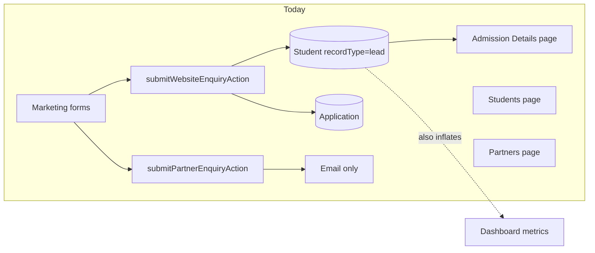
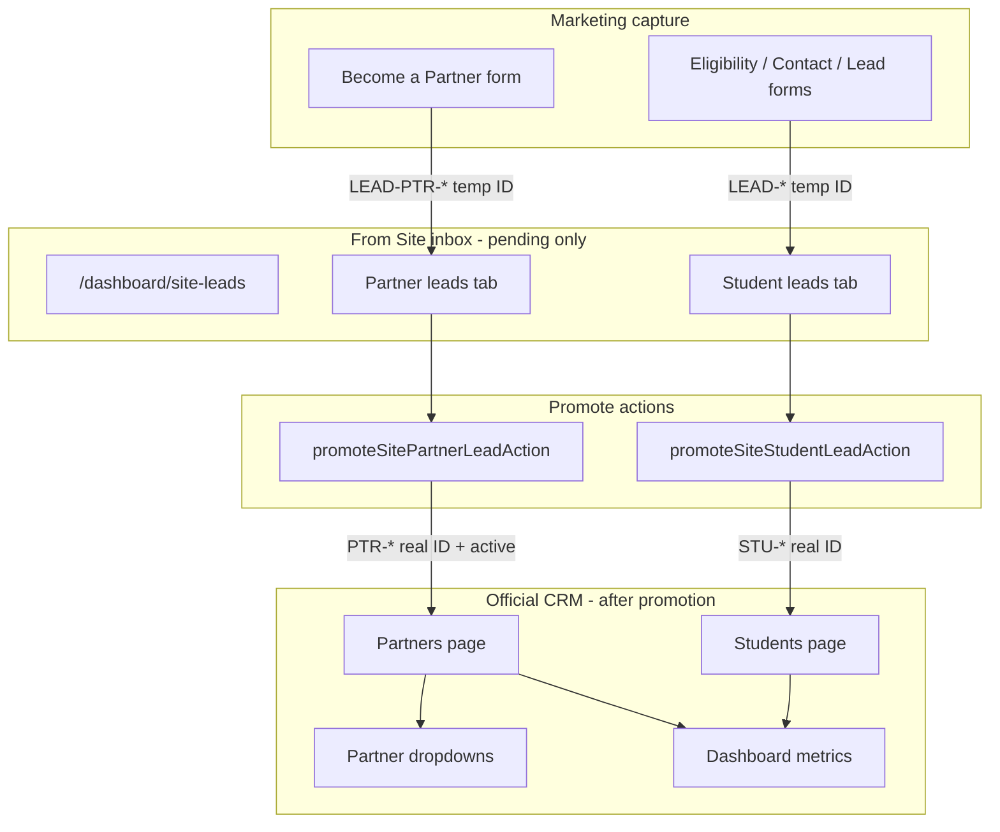

# From Site Leads Inbox

## Current state (what we build on)



- **Student website enquiries** already persist via [`lib/actions/enquiry.actions.ts`](lib/actions/enquiry.actions.ts) as `Student` with `recordType: "lead"`, `metadata.leadSource: "website"`, but they currently receive a **real** `STU-*` ID immediately via [`allocateStudentId()`](lib/services/student-id.service.ts).
- **Partner website enquiries** only send email + activity log via [`lib/actions/partner-enquiry.actions.ts`](lib/actions/partner-enquiry.actions.ts) — **no CRM record**.
- [`/dashboard/admissions`](app/(dashboard)/dashboard/admissions/page.tsx) shows **all** `recordType: lead` records (manual + website).
- Dashboard core student stats in [`lib/services/dashboard.service.ts`](lib/services/dashboard.service.ts) **do not** exclude admission leads today (leads inflate `totalStudents`).

**Your choice:** website student leads move to the new inbox; **Admission Details = manual leads only**.

---

## Target architecture



---

## 1. Data model changes

### Student (website leads)

Extend [`models/Student.ts`](models/Student.ts) metadata (no breaking schema change):

| Field | Purpose |
|-------|---------|
| `metadata.leadSource: "website"` | Already exists — gate for site inbox |
| `metadata.promotionStatus: "pending" \| "promoted"` | New — hides from site inbox after promotion |
| `metadata.promotedAt` | New — audit timestamp |
| `metadata.promotedBy` | New — user who promoted |

**Temporary ID format:** `LEAD-{CODE}-{000001}` (parallel to `STU-{CODE}-*`)

- New helper in [`lib/services/student-id.service.ts`](lib/services/student-id.service.ts): `allocateWebsiteLeadId()`
- [`submitWebsiteEnquiryAction`](lib/actions/enquiry.actions.ts): use `allocateWebsiteLeadId()` instead of `allocateStudentId()`, set `promotionStatus: "pending"`

**On promotion:** `promoteSiteStudentLeadAction`

- Validate lead is website + pending
- Assign new official ID via `allocateStudentId()`
- Set `recordType: "student"`, `metadata.promotionStatus: "promoted"`
- Keep same Mongo `_id` so linked [`Application`](models/Application.ts) stays connected
- Log activity `site_lead.student_promoted`

### Partner (website leads)

Extend [`models/Partner.ts`](models/Partner.ts):

| Field | Purpose |
|-------|---------|
| `partnerCode` | New optional string, unique — temp then official |
| `metadata.leadSource: "website"` | New |
| `metadata.promotionStatus: "pending" \| "promoted"` | New |
| `metadata.isOwner`, `metadata.formCity` | Capture Become-a-Partner fields |

**Temporary ID:** `LEAD-PTR-{CODE}-{000001}`  
**Official ID on promotion:** `PTR-{CODE}-{000001}`

- New [`lib/services/partner-id.service.ts`](lib/services/partner-id.service.ts) mirroring student ID service
- [`submitPartnerEnquiryAction`](lib/actions/partner-enquiry.actions.ts): create `Partner` with `status: "pending"`, temp `partnerCode`, website metadata

**On promotion:** `promoteSitePartnerLeadAction`

- Set `status: "active"`, replace `partnerCode` with official `PTR-*`, `promotionStatus: "promoted"`
- Defaults: `actionStatus: "need_action"`, `commissionPercent` from existing partner defaults
- Log activity `site_lead.partner_promoted`

---

## 2. New CRM page: **From Site**

**Route:** `/dashboard/site-leads`  
**Nav:** add to [`components/dashboard/nav-config.ts`](components/dashboard/nav-config.ts) (label **From Site**, icon `Globe` or `Inbox`), placed after Overview or before Students.

**Page:** [`app/(dashboard)/dashboard/site-leads/page.tsx`](app/(dashboard)/dashboard/site-leads/page.tsx)

- Header: “From Site” + pending count badge
- **Toggle tabs:** `Student leads` | `Partner leads` (URL param `?tab=students|partners`)
- Permissions:
  - Student tab: `admissions:read` / `admissions:write`
  - Partner tab: `partners:read` / `partners:write`

**UI components** (new, styled like existing CRM tables + bulk bar patterns):

| Component | Role |
|-----------|------|
| [`components/dashboard/site-leads-tabs.tsx`](components/dashboard/site-leads-tabs.tsx) | Student / Partner toggle |
| [`components/tables/site-student-leads-table.tsx`](components/tables/site-student-leads-table.tsx) | List website student leads |
| [`components/tables/site-partner-leads-table.tsx`](components/tables/site-partner-leads-table.tsx) | List website partner leads |
| [`components/dashboard/site-student-lead-detail.tsx`](components/dashboard/site-student-lead-detail.tsx) | View drawer/sheet: enquiry notes, form page, enquiry type |
| [`components/dashboard/promote-student-lead-sheet.tsx`](components/dashboard/promote-student-lead-sheet.tsx) | Promote: optional assignee/partner before confirm |
| [`components/dashboard/promote-partner-lead-sheet.tsx`](components/dashboard/promote-partner-lead-sheet.tsx) | Promote: confirm + optional commission edit |

**Row actions per lead:**

- **View** — detail sheet
- **Promote** — opens promote sheet → official CRM
- **Delete** — soft confirmation; deletes student lead + linked application, or deletes pending partner record

**Server actions:** new [`lib/actions/site-lead.actions.ts`](lib/actions/site-lead.actions.ts)

- `getSiteStudentLeads()`
- `getSitePartnerLeads()`
- `getSiteLeadCounts()` — nav badge
- `deleteSiteStudentLeadAction()`
- `deleteSitePartnerLeadAction()`
- `promoteSiteStudentLeadAction()`
- `promoteSitePartnerLeadAction()`

---

## 3. Segregate existing menus

### Admission Details (manual only)

Update [`getAdmissions`](lib/actions/admission.actions.ts) filter:

```ts
{ ...admissionLeadsFilter(), "metadata.leadSource": { $ne: "website" } }
```

Also exclude promoted website leads if any legacy rows remain.

### Students page

Already uses [`excludeAdmissionLeadsFilter()`](lib/constants/student-record-type.ts) — promoted students appear only after `recordType` flips to `"student"`.

### Partners page

Update [`getPartners`](lib/actions/partner.actions.ts) default filter to **exclude** website pending leads:

```ts
{ $or: [
  { "metadata.leadSource": { $ne: "website" } },
  { "metadata.promotionStatus": "promoted" }
]}
```

[`getPartnersList()`](lib/actions/partner.actions.ts) already returns `status: "active"` only — dropdowns stay safe after promotion.

---

## 4. Dashboard exclusion (until promoted)

Update [`lib/services/dashboard.service.ts`](lib/services/dashboard.service.ts):

| Metric / query | Change |
|----------------|--------|
| `buildStudentDashboardPipeline` | `$match` with `excludeAdmissionLeadsFilter()` (or explicit `recordType: "student"`) |
| `getLoanStatusChart`, `getMonthlyStudentsChart`, `getLoanAmountChart` | Same exclusion |
| `buildPartnerDashboardPipeline` | `partnersThisMonth` / `partnersLastMonth` count **active only** (align with `totalPartners`) |
| `getLatestPartners` | Exclude `status: "pending"` + `leadSource: website` |
| `buildApplicationDashboardPipeline` | Exclude applications whose student is an unpromoted website lead |

Add optional Overview widget: **“X leads awaiting review from site”** linking to `/dashboard/site-leads` (counts only pending, not mixed into student/partner totals).

---

## 5. Constants and filters

Extend [`lib/constants/student-record-type.ts`](lib/constants/student-record-type.ts):

```ts
export function websitePendingStudentLeadsFilter() {
  return {
    recordType: "lead",
    "metadata.leadSource": "website",
    "metadata.promotionStatus": { $ne: "promoted" },
  };
}

export function manualAdmissionLeadsFilter() {
  return {
    ...admissionLeadsFilter(),
    "metadata.leadSource": { $ne: "website" },
  };
}
```

New [`lib/constants/site-leads.ts`](lib/constants/site-leads.ts) for partner pending filter + tab labels.

---

## 6. Migration for existing data

One-time script [`scripts/migrate-website-leads-to-site-inbox.ts`](scripts/migrate-website-leads-to-site-inbox.ts):

- Find students: `recordType=lead`, `metadata.leadSource=website`, not yet promoted
- Optionally re-ID existing `STU-*` website leads → `LEAD-*` (preserve `_id`)
- Set `metadata.promotionStatus: "pending"` where missing
- Partner enquiries in activity log only cannot be recovered — new partner form submissions will create records going forward

---

## 7. Tests

Add [`tests/site-leads.test.ts`](tests/site-leads.test.ts):

- Filter helpers (website vs manual admissions)
- Promotion flips `recordType`, assigns new `STU-*` ID
- Partner promotion sets `active` + `PTR-*` code
- Dashboard pipeline excludes pending website leads
- `getPartnersList` unchanged (active only)

---

## UX summary (what staff will see)

1. Marketing form submitted → appears in **From Site** with **temporary ID** (`LEAD-*` / `LEAD-PTR-*`).
2. Staff reviews → **View** details, **Delete** spam, or **Promote**.
3. **Promote student** → moves to **Students** with official `STU-*` ID; visible in dashboard.
4. **Promote partner** → moves to **Partners** with official `PTR-*` ID; appears in partner dropdowns.
5. **Admission Details** shows only manually added leads (not website).
6. Until promotion: **no impact** on main dashboard student/partner counts.

---

## Key files to create / modify

**Create**
- `app/(dashboard)/dashboard/site-leads/page.tsx`
- `lib/actions/site-lead.actions.ts`
- `lib/services/partner-id.service.ts`
- `lib/constants/site-leads.ts`
- `components/dashboard/site-leads-tabs.tsx`
- `components/tables/site-student-leads-table.tsx`
- `components/tables/site-partner-leads-table.tsx`
- `components/dashboard/promote-student-lead-sheet.tsx`
- `components/dashboard/promote-partner-lead-sheet.tsx`
- `tests/site-leads.test.ts`

**Modify**
- [`lib/actions/enquiry.actions.ts`](lib/actions/enquiry.actions.ts)
- [`lib/actions/partner-enquiry.actions.ts`](lib/actions/partner-enquiry.actions.ts)
- [`lib/actions/admission.actions.ts`](lib/actions/admission.actions.ts)
- [`lib/services/student-id.service.ts`](lib/services/student-id.service.ts)
- [`lib/services/dashboard.service.ts`](lib/services/dashboard.service.ts)
- [`lib/actions/partner.actions.ts`](lib/actions/partner.actions.ts)
- [`models/Partner.ts`](models/Partner.ts)
- [`components/dashboard/nav-config.ts`](components/dashboard/nav-config.ts)
