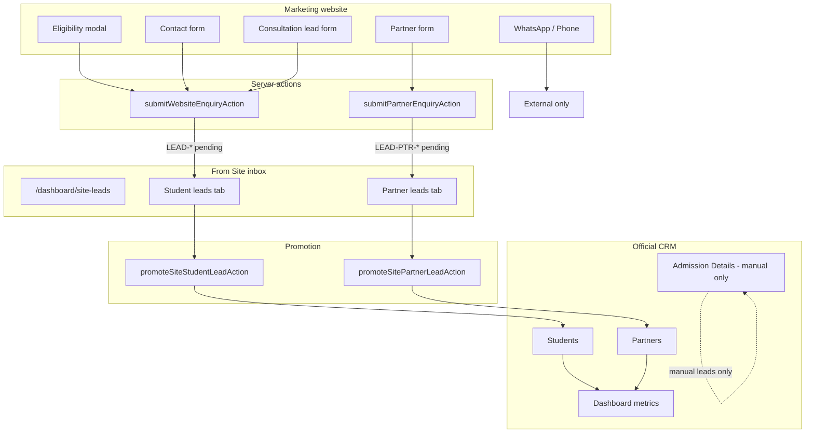

# Website ↔ CRM Integration Analysis

**Date:** July 5, 2026  
**Scope:** Marketing capture flows, From Site inbox, Admissions/Students/Partners segregation, dashboard metrics, email/ops handoff  
**Related docs:** [`site_leads_inbox_bb4641c0.plan.md`](site_leads_inbox_bb4641c0.plan.md), [`website_full_analysis_july_2026.md`](website_full_analysis_july_2026.md), [`project-review-bugs-and-suggestions.md`](project-review-bugs-and-suggestions.md)

---

## Executive summary

The **From Site** inbox is implemented and working end-to-end for both student and partner website leads. Submissions stage in `/dashboard/site-leads` with temporary IDs (`LEAD-*`, `LEAD-PTR-*`) until staff promote them into official Students (`STU-*`) or Partners (`PTR-*`).

**What works well today**

- Student website enquiries → Site Leads (students tab), excluded from Admissions list and dashboard student totals until promoted
- Partner website enquiries → Site Leads (partners tab), excluded from Partners list until promoted
- Overview widget + nav badge for pending review count
- Promotion sheets with optional assignee/partner (student) and commission (partner)
- Migration script for legacy website student leads
- Dev hot-reload fix + auto-repair for partner metadata that was dropped by stale Mongoose models

**Highest-impact remaining gaps**

1. Staff notification emails still point to **Admissions** (students) or have **no CRM link** (partners) — ops mismatch with the new inbox
2. Admission **detail/edit** routes still use broad lead filters — direct URL access can bypass list segregation
3. Partner **detail/edit** routes load any partner by `_id` — pending site leads reachable if ID is known
4. Rich eligibility fields (loan amount, preferred lender, current status) live only in notes — not structured, not in email
5. Contact page runs **three overlapping student funnels** on one screen

---

## Architecture: today’s flow

---

## Feature comparison: Web vs CRM

| Area | Marketing website | CRM (post–From Site) | Aligned? |
|------|-----------------|----------------------|----------|
| **Primary student funnel** | Eligibility modal site-wide | Site Leads → promote → Students | Yes |
| **Contact enquiry** | Contact form on `/contact` | Site Leads (student) | Yes |
| **Consultation** | Lead form on `/contact` | Site Leads (student) | Yes |
| **Partner programme** | `/become-a-partner` form | Site Leads (partner) → promote → Partners | Yes (after hot-reload fix) |
| **Manual admissions** | N/A (staff-only) | Admission Details | Yes — website leads excluded from list |
| **Staff email alert** | All forms | Link to Admissions (student) / no link (partner) | **No** |
| **Application record** | Created on every student enquiry | Linked to same `_id` after promotion | Partial — `loanAmount` always 0 at create |
| **Duplicate handling** | Student phone blocks re-submit | N/A | Partial — returning visitors blocked |
| **Lender prefill** | Carousel / explorer sets `preferredLender` | Stored in notes only | Partial |
| **Country prefill** | Country pages don’t prefill destination | `targetCountry` optional on student | **No** |
| **Dashboard totals** | N/A | Pending site leads excluded | Yes |
| **Overview visibility** | N/A | “X leads awaiting review” banner | Yes |

---

## Capture flow reference

### Student paths → `submitWebsiteEnquiryAction`

| Source | `enquiryType` | Key fields | DB | Email |
|--------|---------------|------------|-----|-------|
| Eligibility modal | `eligibility` | name, phone, email?, country?, loan amount, status, preferred lender, message | Student (`LEAD-*`) + Application | Yes |
| Contact form | `contact` | name, phone, subject, message, email? | Same | Yes |
| Consultation form | `consultation` | name, phone, country?, course?, loan checkbox, message | Same | Yes |

**Backend behaviour**

- Rate limit: 5 / 15 min / IP (bucket name `website-enquiry`)
- Honeypot: contact + consultation only (not eligibility modal)
- Phone duplicate: blocks if phone exists on any `Student` (including pending site leads)
- Revalidation: `/dashboard/site-leads`, `/dashboard/overview`

**Data gaps on create**

- `loanAmount`, `currentStatus`, `preferredLender` → concatenated into `notes[]` only
- `Application.loanAmount` → always `0` at creation
- Email body omits loan amount, current status, preferred lender (staff must open CRM)

### Partner path → `submitPartnerEnquiryAction`

| Source | Key fields | DB | Email |
|--------|------------|-----|-------|
| `/become-a-partner` | name, email, phone, company, city, owner?, WhatsApp logic | Partner (`LEAD-PTR-*`, `pending`) | Yes |

**Backend behaviour**

- Same rate-limit bucket as student forms
- No honeypot on form (schema supports it; UI does not send it)
- No duplicate check on phone / email / company
- `ensureWebsitePartnerLeadRecord()` + `repairLegacyWebsitePartnerLeads()` guard metadata after dev hot reload
- `mobileIsWhatsapp` / separate WhatsApp → email only when different from phone; not stored on `Partner`

---

## CRM inbox feature inventory

### `/dashboard/site-leads`

| Feature | Student tab | Partner tab |
|---------|-------------|-------------|
| Permission | `admissions:read` / `admissions:write` | `partners:read` / `partners:write` |
| List + search + pagination | Yes | Yes |
| View detail sheet | Yes (notes, enquiry type, form page) | Yes (company, contact grid) |
| Promote | Optional assignee + consultancy | Optional commission % |
| Delete | Student + linked Application | Partner record only |
| Nav badge count | Included in total | Included in total |

### Segregation rules (implemented)

| Surface | Filter / rule |
|---------|----------------|
| Site Leads students | `websitePendingStudentLeadsFilter()` |
| Site Leads partners | `websitePendingPartnerLeadsFilter()` |
| Admission Details list | `manualAdmissionLeadsFilter()` |
| Students page | `excludeAdmissionLeadsFilter()` |
| Partners list | `officialPartnersFilter()` |
| Partner dropdowns | `getPartnersList()` → `status: active` only |
| Dashboard student metrics | `excludeAdmissionLeadsFilter()` on aggregates/charts |
| Dashboard partner month counts | Active partners only |
| Dashboard applications pending | Excludes apps tied to unpromoted website student leads |
| Latest partners widget | `officialPartnersFilter()` |

---

## Issues found (with severity)

### Critical / high

| # | Issue | Impact | Suggested fix |
|---|-------|--------|---------------|
| H1 | Student enquiry email CTA → `/dashboard/site-leads?tab=students` | Staff land on wrong screen; website leads not there | **Fixed** — `email.service.ts` |
| H2 | Partner enquiry email has no dashboard link | Slower triage | **Fixed** — `email.service.ts` |
| H3 | Admission get-by-id / edit still uses `admissionLeadsFilter()` | Direct URL can open website pending leads in Admission UI | **Fixed** — `manualAdmissionLeadsFilter()` on all ID-based admission actions |
| H4 | `getPartnerById` / `getPartnerForEdit` use bare `findById` | Pending site partner visible on detail route | **Fixed** — `officialPartnerByIdFilter()` on read/update/delete |

### Medium

| # | Issue | Impact | Suggested fix |
|---|-------|--------|---------------|
| M1 | Eligibility fields only in notes | No reporting/filtering on loan amount, lender, status | Map to structured `metadata` + optional `Application` fields |
| M2 | Application always created with `loanAmount: 0` | Misleading application pipeline | Parse/store eligibility loan amount on Application at capture |
| M3 | Student phone duplicate blocks repeat eligibility | Returning visitors see error | Allow duplicate if existing row is pending unpromoted website lead |
| M4 | Shared rate-limit bucket for student + partner | One IP can block the other channel | **Fixed** — separate `website-student-enquiry` / `website-partner-enquiry` keys |
| M5 | Partner form missing honeypot | Slightly higher spam risk | **Fixed** — hidden `website` field on partner form |
| M6 | Contact page: 3 student funnels | Confusing UX, duplicate leads | Keep eligibility + one written form; remove or collapse consultation block |

### Low

| # | Issue | Impact | Suggested fix |
|---|-------|--------|---------------|
| L1 | LeadForm variants (`quick`, `loan`, `country`) unused | Dead code / maintenance | Remove or wire to country/service pages |
| L2 | Country pages don’t prefill eligibility destination | Extra friction | Pass `defaultCountry` into modal from country slug |
| L3 | “20+ lenders” copy vs 18 in `MARKETING_LENDERS` | Trust/copy mismatch | Align marketing copy to 18 or add lenders |
| L4 | Contact `subject` merged into message only | Hard to filter in CRM | Add `metadata.subject` or structured note tag |
| L5 | Partner WhatsApp / `isOwner` sometimes missing on old rows | Detail shows “—” for Is owner | Repair script already backfills; extend migration for `isOwner` from create payload |
| L6 | Tests don’t cover promote/delete/repair mutations | Regression risk | Extend `tests/site-leads.test.ts` with action-level tests |

---

## Fixes already applied (this sprint)

| Fix | Files / behaviour |
|-----|-------------------|
| From Site inbox (full plan) | `site-lead.actions.ts`, page, tables, sheets, nav badge |
| Partner leads not appearing | `Partner.ts` dev model reload; `website-partner-lead.service.ts` repair |
| Student detail ObjectId serialization | `getSiteStudentLeadById` returns plain JSON |
| Promote sheet layout | Full-width fields, horizontal footer |
| Partner detail sheet layout | `site-partner-lead-detail.tsx` grid + sheet padding |

---

## Suggested features — interlinked (Web + CRM)

These connect marketing capture to dashboard workflows and are highest ROI for ops.

### 1. Unified staff notification deep links

- **Student email:** “Open From Site” → `/dashboard/site-leads?tab=students`
- **Partner email:** “Review partner lead” → `/dashboard/site-leads?tab=partners`
- **Optional:** Include temp ID (`LEAD-*` / `LEAD-PTR-*`) in subject line for search

**Touches:** `lib/services/email.service.ts` only — small change, immediate ops win.

### 2. Structured eligibility metadata

Map modal step-2 fields into queryable fields:

| Web field | CRM storage |
|-----------|-------------|
| Loan amount | `metadata.loanAmount` + `Application.loanAmount` (parsed) |
| Current status | `metadata.currentStatus` |
| Preferred lender | `metadata.preferredLender` |
| Enquiry type / form page | Already in `metadata` |

**Enables:** Site Leads table columns, filters, richer email, better promotion defaults.

### 3. Country / lender context prefill

- Country pages → open eligibility with `targetCountry` preset
- Lender carousel (already passes `preferredLender`) → also persist to `metadata` and email

**Touches:** `eligibility-modal.tsx`, country page CTAs, `enquiry.actions.ts`.

### 4. Promote-from-email workflow

After deep link, auto-highlight row via query param:

`/dashboard/site-leads?tab=students&highlight={mongoId}`

**Touches:** site-leads tables + optional toast “New lead from website”.

### 5. Site lead → Application preview on promote (student)

On promote sheet, show linked Application summary (status, loan fields) before confirming.

**Uses:** existing Application created at capture — no new web form needed.

### 6. Close the admission/partner detail loopholes

- Admission detail/edit: `manualAdmissionLeadsFilter()` on all ID-based queries
- Partner detail: redirect pending website leads to site-leads view or 404 on official partner routes

**Keeps** list segregation and direct-route segregation consistent.

### 7. Smarter duplicate policy (student)

| Existing record | New submission |
|-----------------|----------------|
| Pending website lead, same phone | Update notes / metadata, optional “resubmitted” flag |
| Promoted student / manual lead | Keep current “already on file” message |
| Partner | Optional soft duplicate warning (same company + phone) |

### 8. Overview drill-down

Overview banner already links to site-leads — extend with tab-specific counts in email and Slack-style digest (future).

---

## Suggested features — independent

These improve one side without requiring the other immediately.

### Marketing (website only)

| Feature | Benefit |
|---------|---------|
| Honeypot on eligibility + partner forms | Spam reduction |
| Split rate-limit buckets | Fairer limits per form type |
| Simplify `/contact` to one form + eligibility CTA | Clearer UX |
| Loan calculator / EMI widget (static) | Engagement; Epicred-style gap |
| Blog / guides (`/blog`) | SEO long-tail |
| Wire unused LeadForm variants or delete them | Less confusion for devs |
| Align “20+ lenders” copy to actual count | Trust |

### CRM only

| Feature | Benefit |
|---------|---------|
| Bulk promote / bulk delete on Site Leads | Faster triage at volume |
| Assign site lead on view (before promote) | Internal ownership pre-promotion |
| Activity timeline on site lead detail | See resubmissions, promotions |
| SLA badge (e.g. >24h pending) | Prioritize stale leads |
| Export site leads CSV | Offline review |
| Stricter partner detail guard | Security/consistency |
| Integration tests for promote/delete/repair | Safer releases |

### Ops / infrastructure

| Feature | Benefit |
|---------|---------|
| Run `migrate-website-leads-to-site-inbox.ts --confirm` once in prod | Legacy `STU-*` website leads → `LEAD-*` |
| PostHog / analytics event: `site_lead_submitted` / `site_lead_promoted` | Funnel metrics web → CRM |
| Separate `WEBSITE_PARTNER_NOTIFY_EMAIL` env | Route partner alerts to partnerships team |

---

## Priority roadmap

### Phase A — Quick wins (1–2 days) ✅ Completed July 5, 2026

1. ~~Fix email deep links → From Site (H1, H2)~~ — `email.service.ts`
2. ~~Admission/partner detail route segregation (H3, H4)~~ — `admission.actions.ts`, `partner.actions.ts`
3. ~~Partner form honeypot (M5)~~ — `partner-lead-form.tsx`
4. ~~Split rate-limit keys (M4)~~ — `website-student-enquiry` / `website-partner-enquiry` in `rate-limit.ts`

### Phase B — Data quality (3–5 days)

1. Structured eligibility metadata + email parity (M1, M2)
2. Smarter student duplicate handling (M3)
3. Country prefill on eligibility (L2)
4. Contact page funnel simplification (M6)

### Phase C — Scale & polish (1–2 weeks)

1. Site Leads bulk actions + SLA badges
2. Highlight/query param from notifications
3. Promote sheet Application preview
4. Deeper tests + analytics events
5. Marketing content gaps (blog, calculator) per `website_full_analysis_july_2026.md`

---

## Test & migration checklist

**Before production cutover**

- [ ] Run `npx tsx scripts/migrate-website-leads-to-site-inbox.ts --dry-run`
- [ ] Run `--confirm` if legacy website student leads exist with `STU-*` IDs
- [ ] Submit test student eligibility → appears in Site Leads students tab only
- [ ] Submit test partner form → appears in Site Leads partners tab with `LEAD-PTR-*`
- [ ] Promote both → verify Students / Partners pages and dashboard counts
- [ ] Confirm Admissions list excludes website leads
- [ ] Restart dev server after `Partner.ts` schema changes (hot reload)

**Automated tests today**

- `tests/site-leads.test.ts` — filters, route access, ID prefixes, dashboard pipeline
- `tests/finance-forms.test.ts` — enquiry schemas
- `tests/can-access-route.test.ts` — `/dashboard/site-leads` access

**Recommended additions**

- Promotion flips `recordType` and assigns new IDs
- Delete student removes Application
- Partner promotion sets `active` + `PTR-*`
- `repairLegacyWebsitePartnerLeads` backfills broken rows

---

## File map (integration touchpoints)

| Layer | Path |
|-------|------|
| Student capture | `lib/actions/enquiry.actions.ts` |
| Partner capture | `lib/actions/partner-enquiry.actions.ts` |
| Site inbox actions | `lib/actions/site-lead.actions.ts` |
| Partner repair | `lib/services/website-partner-lead.service.ts` |
| Filters | `lib/constants/site-leads.ts`, `lib/constants/student-record-type.ts` |
| Dashboard exclusion | `lib/services/dashboard.service.ts` |
| Admissions list | `lib/actions/admission.actions.ts` |
| Partners list | `lib/actions/partner.actions.ts` |
| Staff email | `lib/services/email.service.ts` |
| Inbox UI | `app/(dashboard)/dashboard/site-leads/page.tsx`, `components/tables/site-*-leads-table.tsx` |
| Marketing forms | `components/marketing/forms/`, `components/marketing/eligibility/` |
| Migration | `scripts/migrate-website-leads-to-site-inbox.ts` |

---

## Summary recommendation

The **web → CRM pipe is connected and production-viable** after the From Site inbox and partner metadata repair. The next best investments are **operational polish** (email links, detail-route guards, structured eligibility data) rather than new routes.

Treat **Phase A** as mandatory before heavy marketing traffic so staff always land in the right inbox and pending leads cannot leak into Admission/Partner detail screens.

For broader product growth (calculator, blog, comparison tools), follow the independent marketing roadmap in [`website_full_analysis_july_2026.md`](website_full_analysis_july_2026.md) — those are complementary, not blockers for CRM integration.
